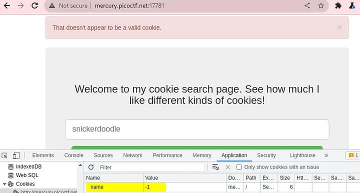
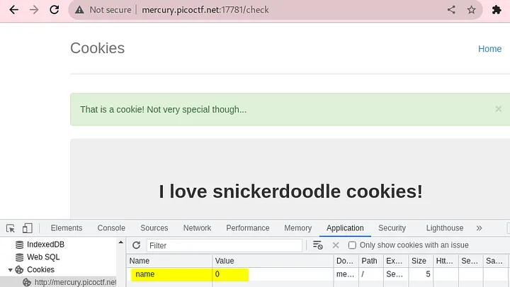
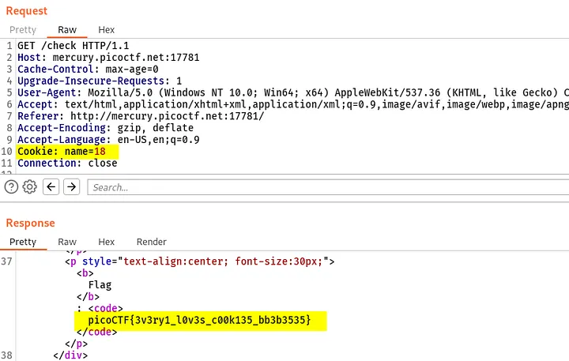

Access the given URL in browser and capture **request/response** using **Burp Suite** tool.
Provide any random text i.e. “kamal” and click on the Search button. Application will show a message as `“That doesn’t appear to be a valid cookie.”` 
and `http://mercury.picoctf.net:17781/search` endpoint as `POST` method is captured in burp which will generate 302 FOUND response and will redirect to home page.

Analyze the generated cookies as challenge description pointing to it. It can be noticed that cookie parameter `“name”` is set to `-1`.

Now provide the same value **“snickerdoodle”** which is reflecting in Search input field and analic. Application will show a message ayze traffic. 
Application will show a message as “That is a cookie! Not very though…” and `http://mercury.picoctf.net:17781/search` endpoint 
as POST method is captured in burp which will generate 302 FOUND response and will redirect to /check endpoint. Also, this time **cookie parameter “name” is set to 0**.

Send `http://mercury.picoctf.net:17781/check` request in Repeater and change name value to 1 then 2. 
Generate responses and observe different response is generated as per the Cookie value.
Send this request to Intruder and add payload in name parameter value to attack as Numbers payload type. 
Observe a different response length for the **Cookie: name=18**. It can be observed that Flag value is revealed in the response for this request.

