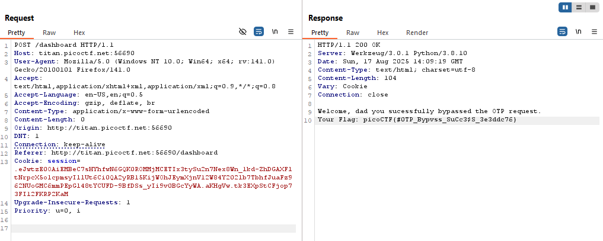

### Step 1: Initial Setup and Observation
Using Burp Suite, I began analyzing the website at `http://titan.picoctf.net:58401`. The Target tab displayed two main paths: `/` and `/dashboard`. 
These paths had both `GET` and `POST` requests associated with them.

### Step 2: Reviewing HTTP Requests and Responses
I started by inspecting the requests and responses:

- GET request to /: This returned a status code of 200 OK, with a response size of 1469 bytes and a MIME type of HTML.
- POST request to /: This resulted in a 302 redirect, with a response size of 656 bytes and a MIME type of HTML.
- GET request to /dashboard: This returned a status code of 200 OK, with a response size of 441 bytes and a MIME type of HTML.
- POST request to /dashboard: This also returned a status code of 200 OK, with a response size of 198 bytes and a MIME type of text.

### Step 3: Sending Requests to Repeater
To dive deeper, I sent each of these requests to the Repeater tool within Burp Suite. This allowed me to modify and resend the requests to see how the server responded.

### Step 4: Manipulating the OTP Field
Focusing on the `/dashboard` POST request, I noticed an OTP field that could be modified. I initially tried changing the OTP to a different number, which returned an **"Invalid OTP"** response.

Curiously, I then replaced the OTP with text, and the response was still **“Invalid OTP.”** Wait… why can I change it to text and the server can returns. 
This indicated that the server wasn’t properly validating the OTP input, as it allowed non-numeric input without error.

### Step 5: Removing the OTP and Finding the Flag
Realizing this, I decided to remove the OTP entirely and resend the request. Upon doing so, the server’s response revealed the flag:

