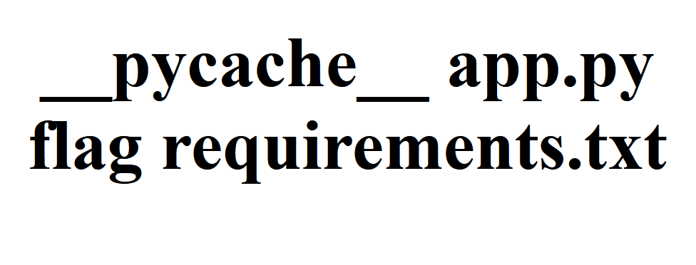

In this article, I will go through my thought process and the steps I took to complete my first PicoCTF challenge, which is the Web Exploitation SSTI1 challenge. SSTI stands for Server-side Template Injection, which is a type of vulnerability where an attacker injects malicious template expressions into input fields that gets processed by the server’s template engine. [This vulnerability causes risks such as information disclosure, remote code execution (RCE) and could grant access to sensitive server-side data such as user data, configuration files and session tokens stored in server memory.](https://owasp.org/www-project-web-security-testing-guide/latest/4-Web_Application_Security_Testing/07-Input_Validation_Testing/18-Testing_for_Server-side_Template_Injection?) Hence why it is crucial to put measures in place to prevent such attacks.

Once the challenge starts, By clicking **Check out my website here!**, we arrive at this page:


It’s implied that this website is vulnerable to SSTI, or server side template injection. Websites use template engines to create dynamic content, and SSTI vulnerabilities arise when user-supplied input is supplied to these template engines. Malicious actors may exploit this to inject code into the site.


To see if we can execute code, we can simply try some operation and put it in brackets to see if it will execute. I tried executing `{7*7}` and it didn’t work, so I added extra brackets and it worked!


Note that `7*7` was evaluated! Then for `{{7*'7'}}`:

Similarly, the input was evaluated. Therefore, this site is in fact vulnerable, and is using either `Jinja2` or `Twig`. Both options are Python libraries, hence our payload will consist of Python.
If we try something like `{{request}}`, we can access the request object itself:

I used a payload found on this blogpost: [onsecurity](https://www.onsecurity.io/blog/server-side-template-injection-with-jinja2/). I tried the a payload that allows RCE bypassing and it worked:
```
{{request.application.__globals__.__builtins__.__import__(‘os’).popen(‘id’).read()}}
```

Now we can go back and tweak some of the data to see what else we can find. I tried replacing “id” (this is a Linux system command that prints out user and group information for the current user) to “ls” like on a Linux terminal to see the files and directories in the current working directory:
```
{{request.application.__globals__.__builtins__.__import__(‘os’).popen(‘ls’).read()}}
```

We can see that there is a “flag” file, which most likely contains the flag for this challenge, so I want to see the content of that file. To do so, I use the Linux command cat and then the name of the file (flag) in the payload:
`{{request.application.__globals__.__builtins__.__import__(‘os’).popen(‘cat flag’).read()}}`


#### Challenge completed!
