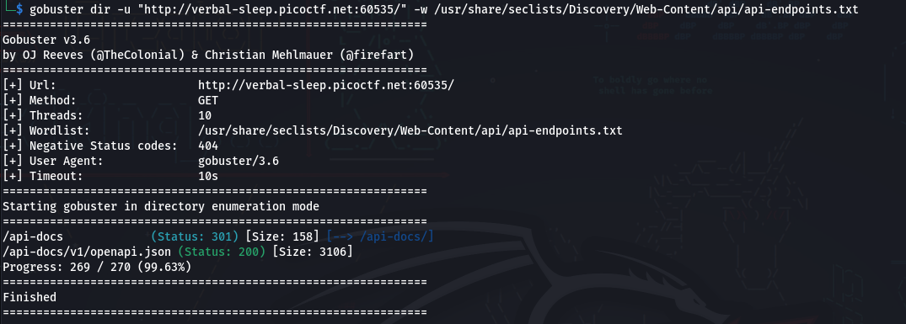
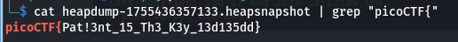

The challenge begins with a simple blog website. After launching the instance, I navigated through the pages, paying close attention to links and hidden endpoints. 
One article titled API Documentation stood out. Clicking it redirected me to /api-docs, which hosted Swagger UI—a tool for visualizing and interacting with APIs.

Inspecting the page source, I didn’t find anything interesting, so since the description mentions **API**, I decided to run `gobuster` and do some `Fuzzing` on the api endpoints:

finding `/api-docs`. By visiting the route: I was taken to the web interface of swagger, which is used for testing api. Let’s move on to the exploitation phase.

The only suspicious api from the previous screenshot was `/heapdump`. Clicking on the **Try it out** button and then on **Execute**.

As we can see, the body contains a file **Download file**. After downloading it and opening it with `cat heapdump-1755436357133.heapsnapshot | grep "picoCTF{"`

